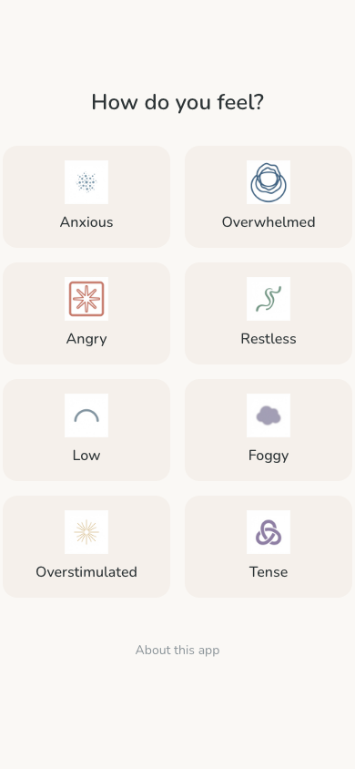

# Right Now

A calm state micro-intervention app that provides instant, low-friction access to scientifically grounded exercises (30s-5m) to help regulate your mental and emotional state in the moment.



## Features

- **Instant access** - No accounts, no onboarding, just immediate help
- **State-based navigation** - Choose how you feel and get matched exercises
- **Offline-capable** - Works without internet after first load
- **Installable PWA** - Add to your home screen for native app experience

## Supported States

- Anxious
- Overwhelmed
- Angry
- Restless
- Low
- Foggy
- Overstimulated
- Tense

## Development

```bash
# Install dependencies
npm install

# Start dev server
npm run dev

# Build for production
npm run build

# Preview production build
npm run preview
```

## Tech Stack

- Preact
- Vite
- Tailwind CSS
- PWA (vite-plugin-pwa)

## Privacy

- No accounts required
- Data stored locally only
- No analytics or tracking
